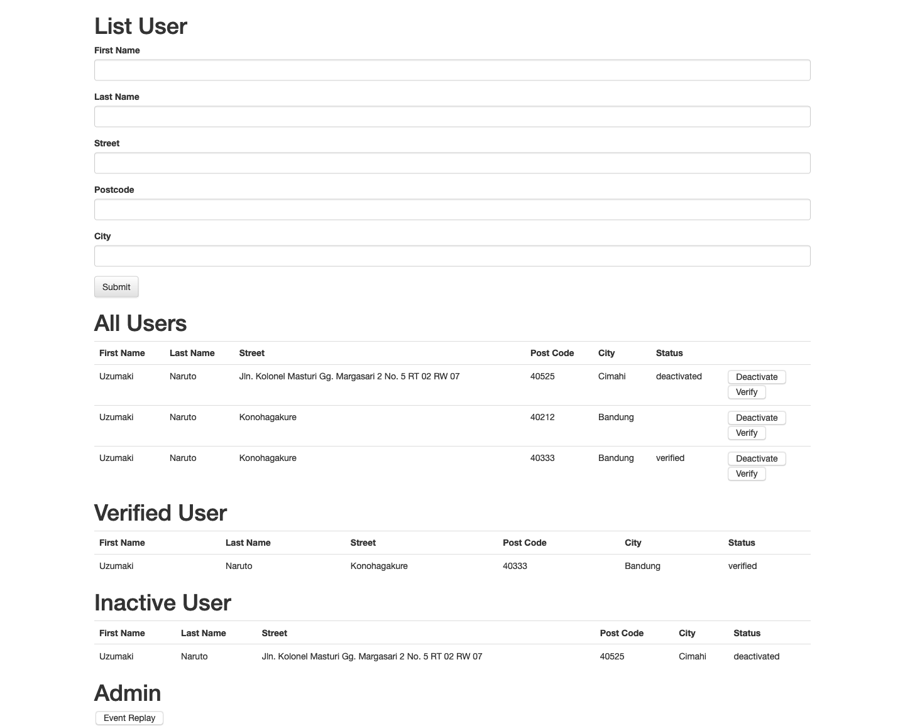

# springboot-event-sourcing

## Things to do:
+ Clone the repository: `git clone https://github.com/hendisantika/springboot-event-sourcing.git`
+ Go to the folder: `cd springboot-event-sourcing`
+ Run the app: `mvn clean spring-boot:run`
+ Go to your favorite browser: http://localhost:8080/user

## Screen shot

User Management Page

